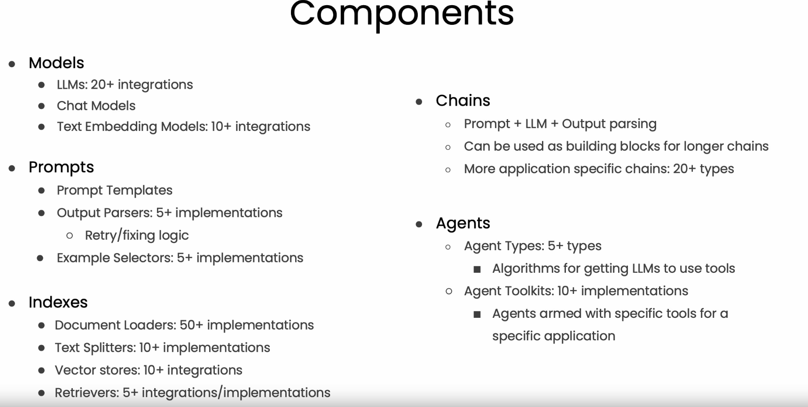

# LangChain for LLM Application Development

[Documentation](https://ashishkrb7.github.io/LangChain-for-LLM-Application-Development/)

## Project Overview

{width:40%;}


## Getting Started

- Install [Miniconda](https://repo.anaconda.com/miniconda/Miniconda3-py310_23.3.1-0-Windows-x86_64.exe) from https:/.conda.io/en/latest/miniconda.html#windows-installers (for python)

- After Anaconda installation, go to search and run Anaconda Prompt and create virtual environment using following commands

    `conda create -y -n gpt python=3.11.0`

- Activate the conda environment

    `conda activate gpt`
    
- Clone the repository to your local machine. 

    `git clone https://github.com/ashishkrb7/LangChain-for-LLM-Application-Development.git` 

- Go to working directory

    `cd LangChain-for-LLM-Application-Development`

- Install the required dependencies using 

    `python -m pip install -r requirements.txt`

- Go to notebook folder

    `cd docs/notebooks`

- Create .env file. It should contain following information

    ```txt
    api_type = 
    api_base = 
    api_version = 
    OPENAI_API_KEY = 
    ```

## Conclusion
