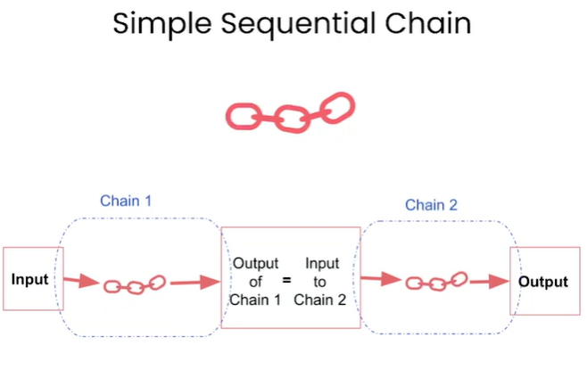
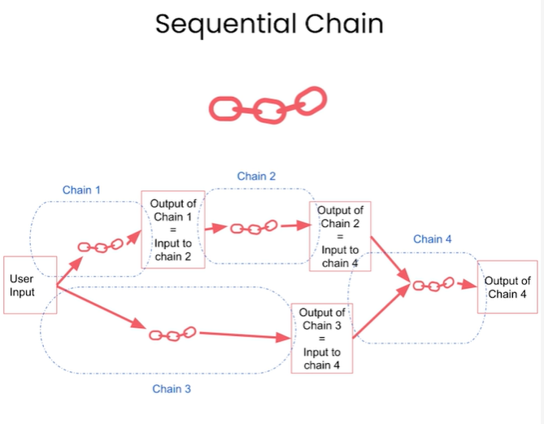
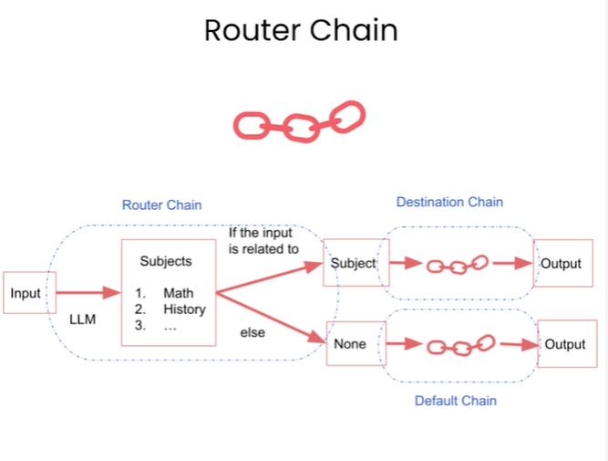

# Chains in LangChain

## Outline

* LLMChain
* Sequential Chains
  * SimpleSequentialChain
  * SequentialChain
* Router Chain


```python
import warnings
warnings.filterwarnings('ignore')
```


```python
import os

from dotenv import load_dotenv, find_dotenv
_ = load_dotenv(find_dotenv()) # read local .env file
```


```python
#!pip install pandas
```


```python
import pandas as pd
df = pd.read_csv('data.csv',delimiter="|")
```


```python
df.head()
```


<div>
<style scoped>
    .dataframe tbody tr th:only-of-type {
        vertical-align: middle;
    }

    .dataframe tbody tr th {
        vertical-align: top;
    }

    .dataframe thead th {
        text-align: right;
    }
</style>
<table border="1" class="dataframe">
  <thead>
    <tr style="text-align: right;">
      <th></th>
      <th>Product</th>
      <th>Review</th>
    </tr>
  </thead>
  <tbody>
    <tr>
      <th>0</th>
      <td>Queen Size Sheet Set</td>
      <td>I ordered a king size set. My only criticism w...</td>
    </tr>
    <tr>
      <th>1</th>
      <td>Waterproof Phone Pouch</td>
      <td>I loved the waterproof sac, although the openi...</td>
    </tr>
    <tr>
      <th>2</th>
      <td>Luxury Air Mattress</td>
      <td>This mattress had a small hole in the top of i...</td>
    </tr>
    <tr>
      <th>3</th>
      <td>Pillows Insert</td>
      <td>This is the best throw pillow fillers on Amazo...</td>
    </tr>
    <tr>
      <th>4</th>
      <td>Milk Frother Handheld</td>
      <td>I loved this product. But they only seem to la...</td>
    </tr>
  </tbody>
</table>
</div>


## LLMChain


```python
from langchain.chat_models import ChatOpenAI
from langchain.prompts import ChatPromptTemplate
from langchain.chains import LLMChain
from langchain.chat_models import AzureChatOpenAI
```


```python
# Set OpenAI API key
os.environ["OPENAI_API_TYPE"] = os.getenv("api_type")
os.environ["OPENAI_API_BASE"] = os.getenv("api_base")
os.environ["OPENAI_API_VERSION"] = os.getenv("api_version")
os.environ["OPENAI_API_KEY"] = os.getenv("OPENAI_API_KEY")
```


```python
llm = AzureChatOpenAI(deployment_name="chatgpt-gpt35-turbo",model_name="gpt-35-turbo",temperature=0.0)
```

```python
prompt = ChatPromptTemplate.from_template(
    "What is the best name to describe \
    a company that makes {product}?"
)
```


```python
chain = LLMChain(llm=llm, prompt=prompt)
```


```python
product = "Queen Size Sheet Set"
chain.run(product)
```


    'Royal Linens.'


## SimpleSequentialChain



```python
from langchain.chains import SimpleSequentialChain
```


```python
# prompt template 1
first_prompt = ChatPromptTemplate.from_template(
    "What is the best name to describe \
    a company that makes {product}?"
)

# Chain 1
chain_one = LLMChain(llm=llm, prompt=first_prompt)
```


```python
# prompt template 2
second_prompt = ChatPromptTemplate.from_template(
    "Write a 20 words description for the following \
    company:{company_name}"
)
# chain 2
chain_two = LLMChain(llm=llm, prompt=second_prompt)
```


```python
overall_simple_chain = SimpleSequentialChain(chains=[chain_one, chain_two],
                                             verbose=True
                                            )
```


```python
overall_simple_chain.run(product)
```

    Error in on_chain_start callback: 'name'
    

    Royal Linens.
    Royal Linens is a luxury bedding company that offers high-quality linens and bedding accessories for a comfortable and stylish home.
    
    > Finished chain.
    


    'Royal Linens is a luxury bedding company that offers high-quality linens and bedding accessories for a comfortable and stylish home.'


## SequentialChain



```python
from langchain.chains import SequentialChain
```


```python
# prompt template 1: translate to english
first_prompt = ChatPromptTemplate.from_template(
    "Translate the following review to english:"
    "\n\n{Review}"
)
# chain 1: input= Review and output= English_Review
chain_one = LLMChain(llm=llm, prompt=first_prompt, 
                     output_key="English_Review"
                    )
```


```python
second_prompt = ChatPromptTemplate.from_template(
    "Can you summarize the following review in 1 sentence:"
    "\n\n{English_Review}"
)
# chain 2: input= English_Review and output= summary
chain_two = LLMChain(llm=llm, prompt=second_prompt, 
                     output_key="summary"
                    )
```


```python
# prompt template 3: translate to english
third_prompt = ChatPromptTemplate.from_template(
    "What language is the following review:\n\n{Review}"
)
# chain 3: input= Review and output= language
chain_three = LLMChain(llm=llm, prompt=third_prompt,
                       output_key="language"
                      )
```


```python
# prompt template 4: follow up message
fourth_prompt = ChatPromptTemplate.from_template(
    "Write a follow up response to the following "
    "summary in the specified language:"
    "\n\nSummary: {summary}\n\nLanguage: {language}"
)
# chain 4: input= summary, language and output= followup_message
chain_four = LLMChain(llm=llm, prompt=fourth_prompt,
                      output_key="followup_message"
                     )
```


```python
# overall_chain: input= Review 
# and output= English_Review,summary, followup_message
overall_chain = SequentialChain(
    chains=[chain_one, chain_two, chain_three, chain_four],
    input_variables=["Review"],
    output_variables=["English_Review", "summary","followup_message"],
    verbose=True
)
```


```python
review = df.Review[0]
overall_chain(review)
```

    Error in on_chain_start callback: 'name'
    

    
    > Finished chain.
    


    {'Review': 'I ordered a king size set. My only criticism would be that I wish seller would offer the king size set with 4 pillowcases. I separately ordered a two pack of pillowcases so I could have a total of four. When I saw the two packages, it looked like the color did not exactly match. Customer service was excellent about sending me two more pillowcases so I would have four that matched. Excellent! For the cost of these sheets, I am satisfied with the characteristics and coolness of the sheets.',
     'English_Review': "I ordered a king size bedding set, but my only complaint is that I wish the seller offered the set with four pillowcases instead of two. I had to order an additional two pack of pillowcases separately to have a total of four. When I received the two packages, it seemed like the color didn't match exactly. However, the customer service was great and they sent me two more pillowcases that matched perfectly. Overall, I am satisfied with the quality and coolness of the sheets considering their cost.",
     'summary': 'The reviewer was satisfied with the quality and coolness of the sheets, but wished the bedding set came with four pillowcases instead of two and had some issues with color matching, but customer service was great and sent matching pillowcases.',
     'followup_message': "Thank you for your review! We're glad to hear that you're satisfied with the quality and coolness of our sheets. We apologize for any inconvenience caused by the bedding set only coming with two pillowcases instead of four and the color matching issues. However, we're happy to hear that our customer service team was able to assist you and send matching pillowcases. We appreciate your feedback and hope to continue providing you with great products and service."}


## Router Chain




```python
physics_template = """You are a very smart physics professor. \
You are great at answering questions about physics in a concise\
and easy to understand manner. \
When you don't know the answer to a question you admit\
that you don't know.

Here is a question:
{input}"""


math_template = """You are a very good mathematician. \
You are great at answering math questions. \
You are so good because you are able to break down \
hard problems into their component parts, 
answer the component parts, and then put them together\
to answer the broader question.

Here is a question:
{input}"""

history_template = """You are a very good historian. \
You have an excellent knowledge of and understanding of people,\
events and contexts from a range of historical periods. \
You have the ability to think, reflect, debate, discuss and \
evaluate the past. You have a respect for historical evidence\
and the ability to make use of it to support your explanations \
and judgements.

Here is a question:
{input}"""


computerscience_template = """ You are a successful computer scientist.\
You have a passion for creativity, collaboration,\
forward-thinking, confidence, strong problem-solving capabilities,\
understanding of theories and algorithms, and excellent communication \
skills. You are great at answering coding questions. \
You are so good because you know how to solve a problem by \
describing the solution in imperative steps \
that a machine can easily interpret and you know how to \
choose a solution that has a good balance between \
time complexity and space complexity. 

Here is a question:
{input}"""
```


```python
prompt_infos = [
    {
        "name": "physics", 
        "description": "Good for answering questions about physics", 
        "prompt_template": physics_template
    },
    {
        "name": "math", 
        "description": "Good for answering math questions", 
        "prompt_template": math_template
    },
    {
        "name": "History", 
        "description": "Good for answering history questions", 
        "prompt_template": history_template
    },
    {
        "name": "computer science", 
        "description": "Good for answering computer science questions", 
        "prompt_template": computerscience_template
    },
    {
        "name": "biology", 
        "description": "Good for answering biology questions", 
        "prompt_template": computerscience_template
    }
]
```


```python
from langchain.chains.router import MultiPromptChain
from langchain.chains.router.llm_router import LLMRouterChain,RouterOutputParser
from langchain.prompts import PromptTemplate
```


```python
destination_chains = {}
for p_info in prompt_infos:
    name = p_info["name"]
    prompt_template = p_info["prompt_template"]
    prompt = ChatPromptTemplate.from_template(template=prompt_template)
    chain = LLMChain(llm=llm, prompt=prompt)
    destination_chains[name] = chain  
    
destinations = [f"{p['name']}: {p['description']}" for p in prompt_infos]
destinations_str = "\n".join(destinations)
```


```python
default_prompt = ChatPromptTemplate.from_template("{input}")
default_chain = LLMChain(llm=llm, prompt=default_prompt)
```


```python
MULTI_PROMPT_ROUTER_TEMPLATE = """Given a raw text input to a \
language model select the model prompt best suited for the input. \
You will be given the names of the available prompts and a \
description of what the prompt is best suited for. \
You may also revise the original input if you think that revising\
it will ultimately lead to a better response from the language model.

<< FORMATTING >>
Return a markdown code snippet with a JSON object formatted to look like:
```json
{{{{
    "destination": string \ name of the prompt to use or "DEFAULT"
    "next_inputs": string \ a potentially modified version of the original input
}}}}
```

REMEMBER: "destination" MUST be one of the candidate prompt \
names specified below OR it can be "DEFAULT" if the input is not\
well suited for any of the candidate prompts.
REMEMBER: "next_inputs" can just be the original input \
if you don't think any modifications are needed.

<< CANDIDATE PROMPTS >>
{destinations}

<< INPUT >>
{{input}}

<< OUTPUT (remember to include the ```json)>>"""
```


```python
router_template = MULTI_PROMPT_ROUTER_TEMPLATE.format(
    destinations=destinations_str
)
router_prompt = PromptTemplate(
    template=router_template,
    input_variables=["input"],
    output_parser=RouterOutputParser(),
)

router_chain = LLMRouterChain.from_llm(llm, router_prompt)
```


```python
chain = MultiPromptChain(router_chain=router_chain, 
                         destination_chains=destination_chains, 
                         default_chain=default_chain, verbose=True
                        )
```


```python
chain.run("What is black body radiation?")
```

    Error in on_chain_start callback: 'name'
    

    physics: {'input': 'What is black body radiation?'}
    > Finished chain.
    


    "Black body radiation refers to the electromagnetic radiation emitted by a perfect black body, which is an object that absorbs all radiation that falls on it and emits radiation at all wavelengths. The radiation emitted by a black body depends only on its temperature and follows a specific distribution known as Planck's law. This type of radiation is important in understanding the behavior of stars, as well as in the development of technologies such as incandescent light bulbs and infrared cameras."


```python
chain.run("what is 2 + 2")
```

    Error in on_chain_start callback: 'name'
    

    math: {'input': 'what is 2 + 2'}
    > Finished chain.
    


    'As an AI language model, I can answer this question easily. The answer to 2 + 2 is 4.'


```python
chain.run("Why does every cell in our body contain DNA?")
```

    Error in on_chain_start callback: 'name'
    

    biology: {'input': 'Why is DNA present in every cell of the human body?'}
    > Finished chain.
    


    'DNA is present in every cell of the human body because it contains the genetic information that determines the characteristics and functions of each cell. This information is necessary for the proper development, growth, and maintenance of the body. Additionally, DNA replication ensures that each new cell produced by the body contains a complete and accurate copy of the genetic information.'


