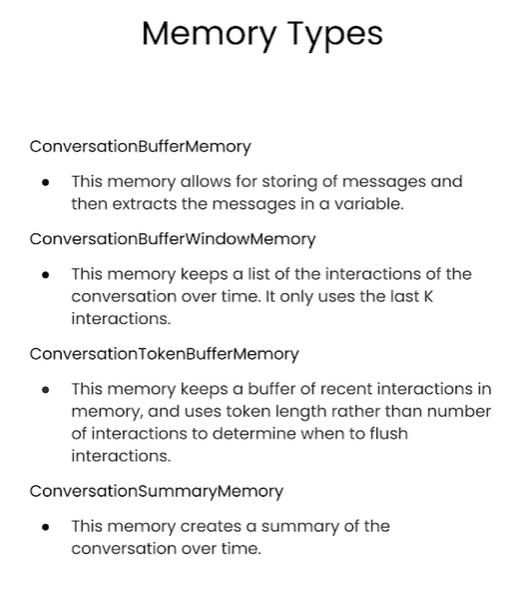

# LangChain: Memory

## Outline
* ConversationBufferMemory
* ConversationBufferWindowMemory
* ConversationTokenBufferMemory
* ConversationSummaryMemory




## ConversationBufferMemory


```python
## Get your OpenAI API
import openai
import os
from langchain.chat_models import AzureChatOpenAI
from langchain.chat_models import ChatOpenAI
from langchain.chains import ConversationChain
from langchain.memory import ConversationBufferMemory

from dotenv import load_dotenv, find_dotenv
_ = load_dotenv(find_dotenv())
```


```python
# Set OpenAI API key
os.environ["OPENAI_API_TYPE"] = os.getenv("api_type")
os.environ["OPENAI_API_BASE"] = os.getenv("api_base")
os.environ["OPENAI_API_VERSION"] = os.getenv("api_version")
os.environ["OPENAI_API_KEY"] = os.getenv("OPENAI_API_KEY")
```


```python
llm = AzureChatOpenAI(deployment_name="chatgpt-gpt35-turbo",model_name="gpt-35-turbo",temperature=0.0)
```

```python
memory = ConversationBufferMemory()
conversation = ConversationChain(
    llm=llm, 
    memory = memory,
    verbose=True
)
```


```python
conversation.predict(input="Hi, my name is Andrew")
```

    Error in on_chain_start callback: 'name'
    

    Prompt after formatting:
    The following is a friendly conversation between a human and an AI. The AI is talkative and provides lots of specific details from its context. If the AI does not know the answer to a question, it truthfully says it does not know.
    
    Current conversation:
    
    Human: Hi, my name is Andrew
    AI:
    
    > Finished chain.
    


    "Hello Andrew, it's nice to meet you. My name is AI. How can I assist you today?"


```python
conversation.predict(input="What is 1+1?")
```

    Error in on_chain_start callback: 'name'
    

    Prompt after formatting:
    The following is a friendly conversation between a human and an AI. The AI is talkative and provides lots of specific details from its context. If the AI does not know the answer to a question, it truthfully says it does not know.
    
    Current conversation:
    Human: Hi, my name is Andrew
    AI: Hello Andrew, it's nice to meet you. My name is AI. How can I assist you today?
    Human: What is 1+1?
    AI:
    
    > Finished chain.
    


    'The answer to 1+1 is 2.'


```python
conversation.predict(input="What is my name?")
```

    Error in on_chain_start callback: 'name'
    

    Prompt after formatting:
    The following is a friendly conversation between a human and an AI. The AI is talkative and provides lots of specific details from its context. If the AI does not know the answer to a question, it truthfully says it does not know.
    
    Current conversation:
    Human: Hi, my name is Andrew
    AI: Hello Andrew, it's nice to meet you. My name is AI. How can I assist you today?
    Human: What is 1+1?
    AI: The answer to 1+1 is 2.
    Human: What is my name?
    AI:
    
    > Finished chain.
    


    'Your name is Andrew, as you mentioned earlier.'


```python
print(memory.buffer)
```

    Human: Hi, my name is Andrew
    AI: Hello Andrew, it's nice to meet you. My name is AI. How can I assist you today?
    Human: What is 1+1?
    AI: The answer to 1+1 is 2.
    Human: What is my name?
    AI: Your name is Andrew, as you mentioned earlier.
    


```python
memory.load_memory_variables({})
```


    {'history': "Human: Hi, my name is Andrew\nAI: Hello Andrew, it's nice to meet you. My name is AI. How can I assist you today?\nHuman: What is 1+1?\nAI: The answer to 1+1 is 2.\nHuman: What is my name?\nAI: Your name is Andrew, as you mentioned earlier."}


```python
memory = ConversationBufferMemory()
```


```python
memory.save_context({"input": "Hi"}, 
                    {"output": "What's up"})
```


```python
print(memory.buffer)
```

    Human: Hi
    AI: What's up
    


```python
memory.load_memory_variables({})
```


    {'history': "Human: Hi\nAI: What's up"}


```python
memory.save_context({"input": "Not much, just hanging"}, 
                    {"output": "Cool"})
```


```python
memory.load_memory_variables({})
```


    {'history': "Human: Hi\nAI: What's up\nHuman: Not much, just hanging\nAI: Cool"}


## ConversationBufferWindowMemory


```python
from langchain.memory import ConversationBufferWindowMemory
```


```python
memory = ConversationBufferWindowMemory(k=1)
```


```python
memory.save_context({"input": "Hi"},
                    {"output": "What's up"})
memory.save_context({"input": "Not much, just hanging"},
                    {"output": "Cool"})
```


```python
memory.load_memory_variables({})
```


    {'history': 'Human: Not much, just hanging\nAI: Cool'}


```python
memory = ConversationBufferWindowMemory(k=1)
conversation = ConversationChain(
    llm=llm, 
    memory = memory,
    verbose=False
)
```


```python
conversation.predict(input="Hi, my name is Andrew")
```


    "Hello Andrew, it's nice to meet you. My name is AI. How can I assist you today?"


```python
conversation.predict(input="What is 1+1?")
```


    'The answer to 1+1 is 2.'


```python
conversation.predict(input="What is my name?")
```


    "I'm sorry, I don't have access to that information. Could you please tell me your name?"


## ConversationTokenBufferMemory


```python
#!pip install tiktoken
```

Below notebook will be helpfull to understand how to use tiktoken library to generate tokens for your application.

https://github.com/pinecone-io/examples/blob/master/generation/langchain/handbook/03-langchain-conversational-memory.ipynb


```python
from langchain.memory import ConversationTokenBufferMemory
from langchain.llms import OpenAI
import tiktoken
```


```python
llm = OpenAI(
    temperature=0, 
    model_name='text-davinci-003'  # can be used with llms like 'gpt-3.5-turbo'
)
```


```python
memory = ConversationTokenBufferMemory(llm=llm, max_token_limit=30)
memory.save_context({"input": "AI is what?!"},
                    {"output": "Amazing!"})
memory.save_context({"input": "Backpropagation is what?"},
                    {"output": "Beautiful!"})
memory.save_context({"input": "Chatbots are what?"}, 
                    {"output": "Charming!"})
# Ideally you should use ChatGPT, I am getting error ```Warning: model not found. Using cl100k_base encoding.```. So, I am using Instruct GPT.

```


```python
memory.load_memory_variables({})
```


    {'history': 'AI: Amazing!\nHuman: Backpropagation is what?\nAI: Beautiful!\nHuman: Chatbots are what?\nAI: Charming!'}


## ConversationSummaryMemory


```python
from langchain.memory import ConversationSummaryBufferMemory
```


```python
# create a long string
schedule = "There is a meeting at 8am with your product team. \
You will need your powerpoint presentation prepared. \
9am-12pm have time to work on your LangChain \
project which will go quickly because Langchain is such a powerful tool. \
At Noon, lunch at the italian resturant with a customer who is driving \
from over an hour away to meet you to understand the latest in AI. \
Be sure to bring your laptop to show the latest LLM demo."

memory = ConversationSummaryBufferMemory(llm=llm, max_token_limit=4000)
memory.save_context({"input": "Hello"}, {"output": "What's up"})
memory.save_context({"input": "Not much, just hanging"},
                    {"output": "Cool"})
memory.save_context({"input": "What is on the schedule today?"}, 
                    {"output": f"{schedule}"})
```


```python
memory.load_memory_variables({})
```


    {'history': "Human: Hello\nAI: What's up\nHuman: Not much, just hanging\nAI: Cool\nHuman: What is on the schedule today?\nAI: There is a meeting at 8am with your product team. You will need your powerpoint presentation prepared. 9am-12pm have time to work on your LangChain project which will go quickly because Langchain is such a powerful tool. At Noon, lunch at the italian resturant with a customer who is driving from over an hour away to meet you to understand the latest in AI. Be sure to bring your laptop to show the latest LLM demo."}


```python
llm_turbo = AzureChatOpenAI(deployment_name="chatgpt-gpt35-turbo",model_name="gpt-35-turbo",temperature=0.0)
```


```python
conversation = ConversationChain(
    llm=llm_turbo, 
    memory = memory,
    verbose=True
)
```


```python
conversation.predict(input="What would be a good demo to show?")
```

    Error in on_chain_start callback: 'name'
    

    Prompt after formatting:
    The following is a friendly conversation between a human and an AI. The AI is talkative and provides lots of specific details from its context. If the AI does not know the answer to a question, it truthfully says it does not know.
    
    Current conversation:
    Human: Hello
    AI: What's up
    Human: Not much, just hanging
    AI: Cool
    Human: What is on the schedule today?
    AI: There is a meeting at 8am with your product team. You will need your powerpoint presentation prepared. 9am-12pm have time to work on your LangChain project which will go quickly because Langchain is such a powerful tool. At Noon, lunch at the italian resturant with a customer who is driving from over an hour away to meet you to understand the latest in AI. Be sure to bring your laptop to show the latest LLM demo.
    Human: What would be a good demo to show?
    AI:
    
    > Finished chain.
    


    "Based on the customer's interests, I would recommend showing the LLM's natural language processing capabilities and how it can be used to analyze large amounts of data quickly and accurately. You could also demonstrate how the LLM can be integrated with other AI tools to create a more comprehensive solution."


```python
memory.load_memory_variables({})
```


    {'history': "Human: Hello\nAI: What's up\nHuman: Not much, just hanging\nAI: Cool\nHuman: What is on the schedule today?\nAI: There is a meeting at 8am with your product team. You will need your powerpoint presentation prepared. 9am-12pm have time to work on your LangChain project which will go quickly because Langchain is such a powerful tool. At Noon, lunch at the italian resturant with a customer who is driving from over an hour away to meet you to understand the latest in AI. Be sure to bring your laptop to show the latest LLM demo.\nHuman: What would be a good demo to show?\nAI: Based on the customer's interests, I would recommend showing the LLM's natural language processing capabilities and how it can be used to analyze large amounts of data quickly and accurately. You could also demonstrate how the LLM can be integrated with other AI tools to create a more comprehensive solution."}


```python

```
